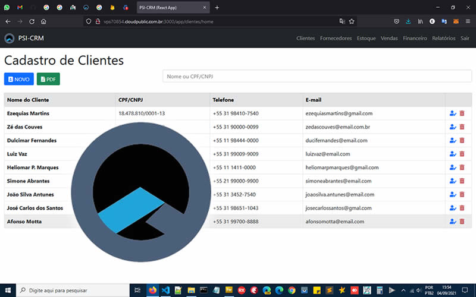

 
## PSI-CRM v1.0

 

Simples de configurar e fácil de usar.
Gerencie seus Clientes, Fornecedores, Produtos, Compras, Vendas, Controle de Estoque, Financeiro, etc. Tudo isso em um único lugar!

## Descrição 
Projeto de Desenvolvimento Web c/ Reactjs com integração c/ Firebase e Bootstrap (HTML5/CSS), com cadastro de Clientes,
Fornecedores, Produtos, Controle de Vendas, Estoque e Financeiro, voltado para Comécio Local de Pequeno Porte como Bares, Restaurantes, Fast-foods & Delivery,
Empresas e Prestadores de Serviços, Hotelaria de Pequeno Porte (Hotéis, Motéis & Pousadas) etc.

## Live Demo 
Você pode acessar esta aplicação online (em demonstração) no link abaixo:  
<a href="http://vps70854.cloudpublic.com.br:3000/" target="_blank">PSI-CRM v1.0</a>
  
by <a href="https://ezequiasmartins.blogspot.com/" target="_blank">Ezequias Martins</a> ® 1999-2022 Direitos Reservados

